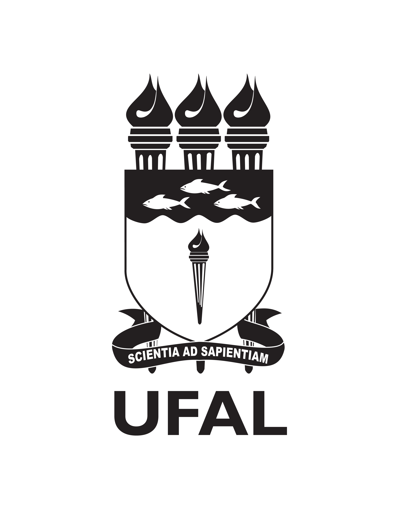

<h1>Lista da Aula Prática de Matemática Discreta</h1>
    
    
    <h3 alignt="left" >Grupo:</h3>
      <ul alignt="left">
        <li>Marcos Melo</li>
        <li>Isabelle Xavier</li>
      </ul>
  <h3 alignt="left" >Docente: </h3>
    <ul alignt="left">
        <li>Bruno Pimentel</li>
      </ul>
  <h3 alignt="left" >Objetivo: </h3>
    
Praticar, através do desenvolvimento de algoritmos na linguagem C, os conteúdos de teoria dos números do primeiro semestre do curso de Ciência da Computação.

